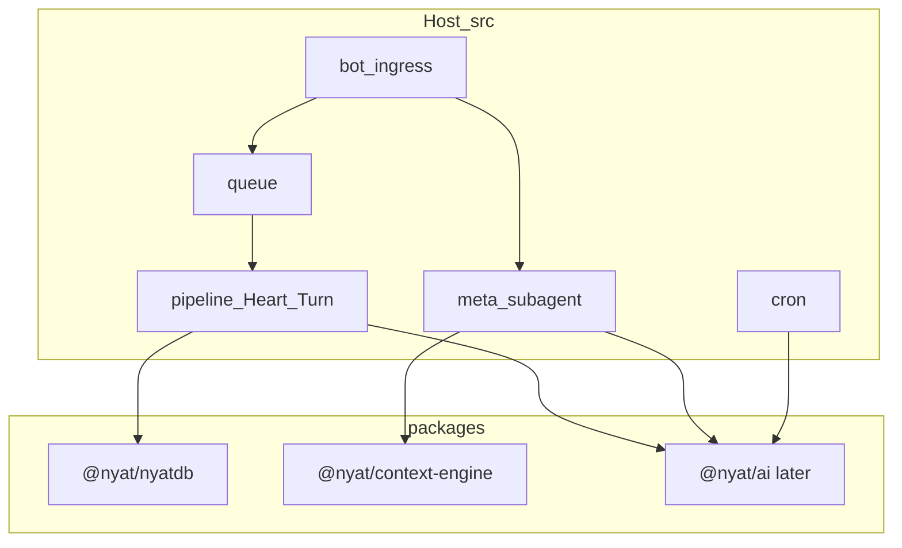

# NyatBot 模块地图（monorepo）

目标形态：**一个 GitHub 仓 + npm workspaces**（`packages/*`），可复用引擎先收成 `@nyat/*` 包；编排/认知仍留在宿主 `src/`。

NyatDB 已有独立公开仓 [ZYHUO/nyatdb](https://github.com/ZYHUO/nyatdb)；本仓以 **workspace 包** 为真相源，外仓可镜像同步。

## 总览

```text
nyat-bot/                         # 宿主：Telegram bot + 编排
├── packages/
│   ├── nyatdb/                   # @nyat/nyatdb
│   └── context-engine/           # @nyat/context-engine
├── native/nyatdb/                # @nyat/nyatdb-native（napi；workspace）
└── src/                          # 宿主部门（见下表）
```



## 部门划分（宿主 `src/`）

| 部门 | 路径 | 职责 | 拆包优先级 |
|------|------|------|------------|
| **Host / Wiring** | `index.ts`, `startup/`, `env.ts` | 进程启动、旗标、装配 | 永不拆外仓 |
| **Bot IO** | `bot/`, `ingress/` | grammY、收发、webhook/polling | 晚 |
| **Queue** | `queue/` | BullMQ、turn 调度、锁 | 晚 |
| **Cognition** | `pipeline/` | Heart / Turn / judge / reply / timing / tools | **不拆**（核心） |
| **Orchestration** | `meta/`, `subagent/`；薄适配 `context-engine/` | Attention → Meta CodeAct → Subagent | context-engine 已进 `@nyat/context-engine` |
| **AI Router** | `ai/` | `callWithFallback`、provider、labels | 二期候选 `@nyat/ai` |
| **Memory** | `memory/` | Qdrant、重要度、visibility | 三期 |
| **NyatDB glue** | `src/nyatdb/`（薄适配） | `env` → `getNyatDb()`、双写开关 | 引擎在 `packages/nyatdb` |
| **Person / Tracking** | `tracking/` | 画像、关系、睡眠、作息 | 晚 |
| **Knowledge** | `knowledge/`, `learners/` | 知识库、贴纸、黑话学习 | 晚 |
| **Features** | `pipeline/dm-relay`, `gacha`, `games`, `allowlist`, `verification` | 产品功能岛 | 按岛可选拆 |
| **Cron** | `cron/` | 定时任务 | 留宿主 |
| **Admin** | `admin/` (monitor API + runtime-config) | HTTP, token-gated read-only |
| **Data** | `db/` | SQLite / Redis 客户端 | 留宿主 |
| **Shared** | `shared/` | logger、types、chat 工具 | 极薄；日后 `@nyat/shared` 可选 |

## 包演进路线

### 第一期 — `@nyat/nyatdb`（已落地）

- **包内**：页式引擎（TS）+ facade + ChatLog codec + native loader  
- **包外（宿主）**：`NYATDB_*` 旗标、`context/manager` 双写/读、migrate/bench 脚本  
- **约束**：包不依赖 `env.ts` / grammY / Redis；只接受 `OpenOptions` + 可选 logger  
- **native**：仍 `@nyat/nyatdb-native`（`native/nyatdb`），由包解析 `.node`

### 第二期 — `@nyat/context-engine`（已落地）

- **包内**：`static|delta|ephemeral|volatile` 组装 + Manifest  
- **包外**：`CONTEXT_ENGINE_ENABLED` + pino，经 `src/context-engine/` 适配  
- **调用方**：`meta/session`、`subagent/executor`（仍 import 宿主适配路径，兼容不变）

### 第三期候选（按耦合从低到高）

1. **`@nyat/ai`** — `callWithFallback` + provider 解析；宿主注入 Redis cooldown / 路由覆盖  
2. **`@nyat/memory-qdrant`** — search/upsert + visibility scrub（需仔细切隐私层）

### 明确不进第一期

- `pipeline/`（Heart/Turn/timing/reply）  
- `meta/` + `subagent/`（host API 绑 Telegram / 记忆 / 贴纸）  
- 把整个 bot 拆成微服务  

## 工作约定

- 新可复用能力：**先**想清是否进 `packages/`，默认 OFF 旗标仍在 `env.ts`  
- 包公开 API 只从 `packages/<name>/src/index.ts` 导出  
- 宿主通过 `import { … } from '@nyat/nyatdb'`；过渡期可保留 `src/nyatdb` 再导出  
- 测试：包自测在 `packages/*/tests`；宿主集成测仍在 `tests/unit/`  

## 与外仓关系

| 仓 | 角色 |
|----|------|
| `ZYHUO/nyat-bot` | 宿主 + workspaces 真相源 |
| `ZYHUO/nyatdb` | 引擎公开镜像（无 `.env` / 无 `data/`） |

同步方向：本仓 `packages/nyatdb` → 推镜像到 `nyatdb` 仓（脚本后续可加）。
